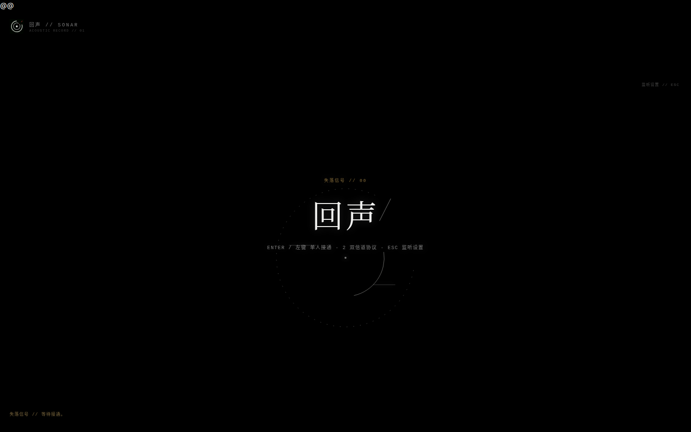
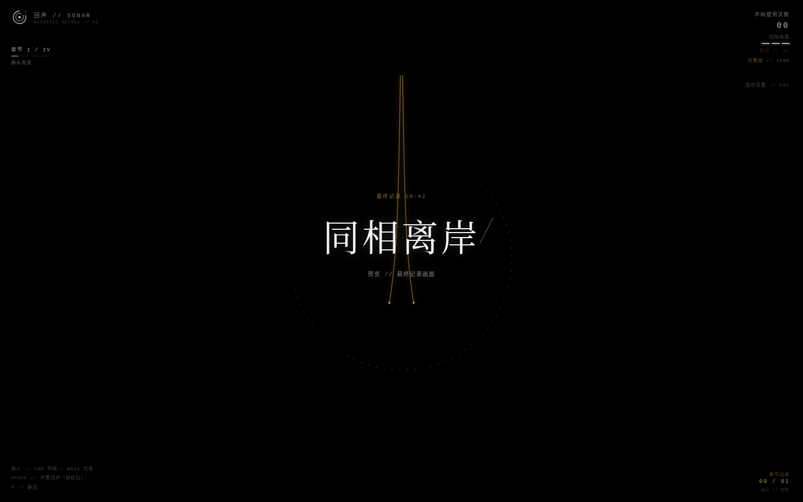
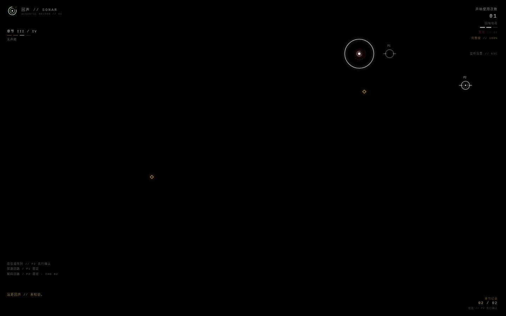

# 《回声》· Sonar

> **声音抵达之处，未必安全。**



《回声》是一款单文件 Canvas 氛围恐怖迷宫游戏。在绝对黑场中，玩家只能以声呐短暂确认空间；每次发声都会照亮墙体、记录与出口，也会把自己的位置交给黑暗中的回应者。游戏以四章通关结构组织，从观察巡逻、外置诱导与静默舱，到最终追猎撤离，逐步将“发声即代价”推向更高压力。

项目采用**盲域极简主义**视觉：冷白代表可被确认的证据，余烬红代表暴露与威胁，旧金只用于远端出口与离开方向。完整白色声呐环是画面中唯一稳定的几何；其余空间始终会重新坠回黑暗。

## 核心体验

| 系统 | 说明 |
| --- | --- |
| 声呐探路 | 主声呐扫描隐藏迷宫，短暂显形墙体、怪物、记录、静默舱与出口。 |
| 风险循环 | 声呐次数会提高警觉；怪物会调查主声呐位置，玩家必须决定何时确认、何时静默。 |
| 四章推进 | 观察巡逻、主动诱导、静默重置、追猎撤离依次复用并反转既有规则。 |
| 声音叙事 | 全部使用 Web Audio 合成的低频环境床、空间怪物声纹、记录提示与威胁混音，不使用合成语音。 |
| 档案与重玩 | 信号完整度影响 AR-01 至 AR-05 的恢复文本；章节回放保存最佳完整度、无伤和低声呐勋记。 |
| 多结局 | 单人结局由历史完整度决定；双人第四章则根据合作默契进入 CR-00、CR-01 或 CR-02。 |

## 本地双人：默契试炼

按标题页的 `2` 进入**双信道协议**。本模式是同屏本地协作，不需要联网或额外服务。

| 角色 | 职责 | 输入 |
| --- | --- | --- |
| 探路回路 / P1 | 移动、主声呐、引开危险并为团队确认空间。 | `WASD` 移动；`E` 或左键发射主声呐。 |
| 解码回路 / P2 | 移动、短程解析并恢复章节记录。 | 方向键移动；`/` 发射解析脉冲。 |

双人撤离要求两人同时抵达出口；任一人倒地后，伙伴可在 6.8 秒内靠近并按 `R` 重连。章节记录恢复后，撤离门会依章节切换校验方式：第一章同步驻留，第二章 P1 先行，第三章 P2 先行，第四章需先释放再同步。分离时还会出现不具视觉标记的远距伪回声，团队必须通过沟通判断它是否可信。

> **默契记录：** 四章累计的“无断线”与“低警觉”勋记决定 CR-00《失配记录》、CR-01《双声残响》或 CR-02《同相离岸》。门槛故意不显示为进度条。

## 画面



*第三章试炼：解码回路先行锁定，探路回路需在短窗口内响应。画面只给出短暂证据，真正的判断留给两名玩家。*



*CR-02《同相离岸》：双信道在离开前保持同相，旧金轨迹成为唯一的远端方向。*

## 控制与监听

| 输入 | 功能 |
| --- | --- |
| 左键 / `E` | P1 主声呐。 |
| `/` | P2 解析脉冲。 |
| `Space` | 部署已授权的外置回声诱饵。 |
| `R` | 邻近重连；失败后重载本章。 |
| `F` | 打开设备档案。 |
| `C` | 打开章节回放。 |
| `Esc` | 打开监听校准与音量/低频设置。 |
| `M` | 持久化静音切换。 |

建议使用耳机体验：怪物与队友提示会根据距离和左右方位改变声像、滤波与音量。首次操作后浏览器才会解锁音频输出。

## 本地运行

该仓库是 Vite 静态前端外壳，游戏主体位于 `client/public/echo.html`，不依赖后端服务。

```bash
pnpm install
pnpm dev
```

打开开发服务器地址后即可开始。也可以直接以浏览器打开 `client/public/echo.html`；核心 Canvas、输入与 Web Audio 逻辑均在该单文件中。

## 演示入口

以下查询参数仅用于开发与视觉验收，不属于正式玩家功能。

| 地址参数 | 预览内容 |
| --- | --- |
| `?demo&coop&trial=2` | 第二章 P1 先行分站时序。 |
| `?demo&coop&trial=3` | 第三章 P2 先行分站时序。 |
| `?demo&coop&decoy` | 远距伪回声的分离状态。 |
| `?demo&ending=CR-00` | 失配记录画面。 |
| `?demo&ending=CR-01` | 双声残响画面。 |
| `?demo&ending=CR-02` | 同相离岸画面。 |

## 项目文档

| 文档 | 内容 |
| --- | --- |
| [`CHAPTERS.md`](CHAPTERS.md) | 四章策略、叙事与规则反转。 |
| [`COOP.md`](COOP.md) | 本地双人角色、救援与撤离协议。 |
| [`COOP_CHALLENGES.md`](COOP_CHALLENGES.md) | 协作勋记、触点与伙伴方位反馈。 |
| [`COOP_TRIALS.md`](COOP_TRIALS.md) | 默契终局、时序组合与伪回声规则。 |
| [`AUDIO.md`](AUDIO.md) | Web Audio 环境、威胁与空间声设计。 |
| [`ARCHIVES.md`](ARCHIVES.md) | 档案、完整度与单人最终记录。 |
| [`STRUCTURE.md`](STRUCTURE.md) | 项目结构与运行时模块索引。 |

## 技术构成

`Canvas 2D` · `原生 JavaScript` · `Web Audio API` · `React 19` · `Vite`

游戏逻辑不依赖游戏引擎，所有关键机制都集中在一个可独立运行的 HTML 文件中，以便持续迭代和直接分发。
